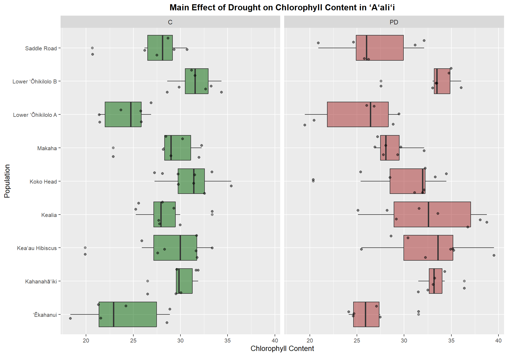
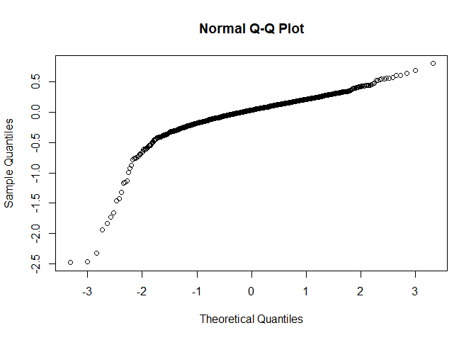
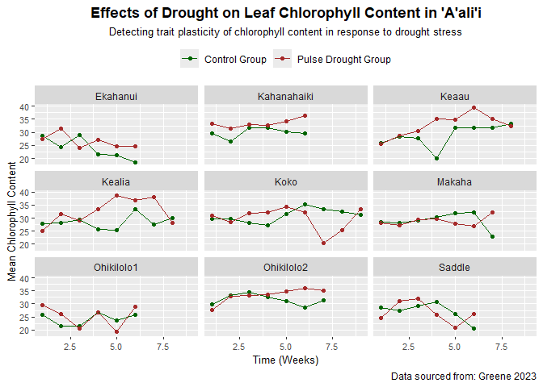
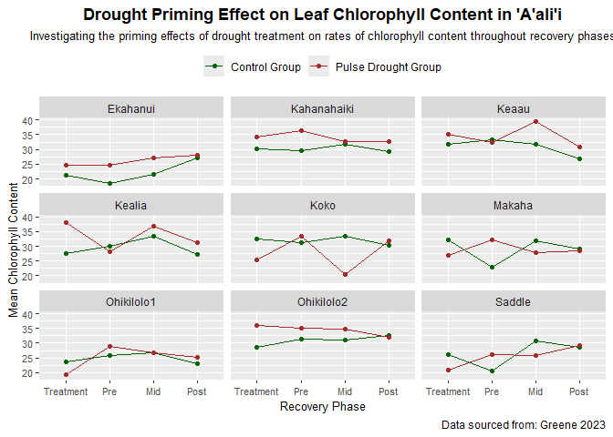

Final Project
================
Kauanoe Greene
2024-12-04

# Libraries

``` r
# visuals
library(tidyverse)
library(dplyr)
library(tidytext)
library(here)
library(gganimate)

# models (stats)
library(lmerTest)
library (RLRsim)
library(Matrix)
# library(lme4)
library(lattice)
library(car)
library(nlme)
```

# Data

``` r
# Data uploading
functional.phase.data <- read_csv(here("Final_Project", "Data", "functional.phase.data.csv"))
glimpse(functional.phase.data)
```

    ## Rows: 1,107
    ## Columns: 12
    ## $ Week        <dbl> 1, 1, 1, 1, 1, 1, 1, 1, 1, 1, 1, 1, 1, 1, 1, 1, 1, 1, 1, 1…
    ## $ Population  <chr> "Koko", "Koko", "Koko", "Koko", "Koko", "Koko", "Koko", "K…
    ## $ ID          <chr> "K13A", "K14A", "K15A", "K16A", "K17A", "K18A", "K19A", "K…
    ## $ Treatment   <chr> "C", "C", "C", "C", "C", "C", "C", "C", "C", "C", "C", "C"…
    ## $ Conductance <dbl> 245.1, 266.1, 300.1, 274.6, 244.1, 226.2, 272.4, 196.2, 25…
    ## $ Chlorophyll <dbl> 38.9, 26.5, 26.1, 35.2, 34.2, 32.9, 30.2, 26.3, 27.0, 32.0…
    ## $ Alpha       <dbl> NA, NA, NA, NA, NA, NA, NA, NA, NA, NA, NA, NA, NA, NA, NA…
    ## $ ETRmax      <dbl> NA, NA, NA, NA, NA, NA, NA, NA, NA, NA, NA, NA, NA, NA, NA…
    ## $ Ek          <dbl> NA, NA, NA, NA, NA, NA, NA, NA, NA, NA, NA, NA, NA, NA, NA…
    ## $ NPQmax      <dbl> NA, NA, NA, NA, NA, NA, NA, NA, NA, NA, NA, NA, NA, NA, NA…
    ## $ `Fv/Fm`     <dbl> NA, NA, NA, NA, NA, NA, NA, NA, NA, NA, NA, NA, NA, NA, NA…
    ## $ Phase       <chr> "Treatment", "Treatment", "Treatment", "Treatment", "Treat…

``` r
view(functional.phase.data)
```

# Statistic Modeling: Chlorophyll Content Data

- PT.I: Primary interaction treatment  
- PT.II: Reduced models  
- PT.III: Comparison models

## PT.I: Full Model

- main interaction  
- includes all main factors and interactions  
- F-statistic for a fixed effects mixed model  
- results table: drought column

``` r
# drought column result: (F-stat) 3.9797, (p-val) 0.07637

chl.full.A = lmer(Chlorophyll ~ Treatment + 
                    (1|ID) + 
                    (1|Population) + 
                    (1|Week) + 
                    (1|Population:Treatment) +  
                    (1|Treatment:Week), 
                  data = functional.phase.data, 
                  na.action = na.omit)

Anova(chl.full.A, test.statistic="F", type=3)
```

    ## Analysis of Deviance Table (Type III Wald F tests with Kenward-Roger df)
    ## 
    ## Response: Chlorophyll
    ##                    F Df  Df.res    Pr(>F)    
    ## (Intercept) 830.9487  1 11.7778 2.742e-12 ***
    ## Treatment     3.9797  1  9.2353   0.07637 .  
    ## ---
    ## Signif. codes:  0 '***' 0.001 '**' 0.01 '*' 0.05 '.' 0.1 ' ' 1

``` r
# Normality check: untransformed data  
# Checking normality of residuals in untransformed data
# W = 0.98162, p-value = 1.319e-10

shapiro.test(resid(chl.full.A)) 
```

    ## 
    ##  Shapiro-Wilk normality test
    ## 
    ## data:  resid(chl.full.A)
    ## W = 0.98162, p-value = 1.319e-10

``` r
# untransformed data: QQPlot  
qqnorm(resid(chl.full.A))
```

<!-- -->

``` r
# log-transformed data
# this will be used in the next steps when we look at it as log-transformed data.
log.chl <- log(functional.phase.data$Chlorophyll)
glimpse(log.chl)
```

    ##  num [1:1107] 3.66 3.28 3.26 3.56 3.53 ...

``` r
# drought column result: (F-stat) 0.5701, (p-val) 0.4732

chl.full.B = lmer(log.chl ~ Treatment + 
                    (1|ID) + 
                    (1|Population) + 
                    (1|Week) + 
                    (1|Population:Treatment) +  
                    (1|Treatment:Week), 
                  data = functional.phase.data, 
                  na.action = na.omit)

Anova(chl.full.B, test.statistic="F", type=3)
```

    ## Analysis of Deviance Table (Type III Wald F tests with Kenward-Roger df)
    ## 
    ## Response: log.chl
    ##                     F Df  Df.res    Pr(>F)    
    ## (Intercept) 5349.3497  1 10.9589 4.325e-16 ***
    ## Treatment      0.5701  1  7.5352    0.4732    
    ## ---
    ## Signif. codes:  0 '***' 0.001 '**' 0.01 '*' 0.05 '.' 0.1 ' ' 1

``` r
# transformed data: QQPlot 
qqnorm(resid(chl.full.B))
```

<!-- -->

## Reduced Models

- work bottom to top approach  
- drop the interaction  
- keep main factors  
- always keep “Treatment” and “(1\|ID)” in all models  
- our goal is to find out if any of these factors improve model fit →  
- does it account for more of the variance in our response trait?  
- if it doesn’t, the chi square value will NOT be significant.  
- the factor we drop from the reduced model is the factor of focus. We
  want to know if adding this factor accounts for MORE variance than the
  treatment alone. A.K.A. we are investigating the effect of the factor
  we drop.

``` r
# 1: (Population:Treatment): chisq 6.5799

chl.red.1 = lmer(Chlorophyll ~ Treatment + 
                   (1|ID) + 
                   (1|Population) + 
                   (1|Week) + 
                   (1|Population:Treatment), 
                 data = functional.phase.data, 
                 na.action = na.omit)
Anova(chl.red.1)
```

    ## Analysis of Deviance Table (Type II Wald chisquare tests)
    ## 
    ## Response: Chlorophyll
    ##            Chisq Df Pr(>Chisq)  
    ## Treatment 6.5799  1    0.01031 *
    ## ---
    ## Signif. codes:  0 '***' 0.001 '**' 0.01 '*' 0.05 '.' 0.1 ' ' 1

``` r
# 2: (Treatment:Time): chisq 4.1081

chl.red.2 = lmer(Chlorophyll ~ Treatment + 
                   (1|ID) + 
                   (1|Population) + 
                   (1|Week) + 
                   (1|Treatment:Week), 
                 data = functional.phase.data,  
                 na.action = na.omit)
Anova(chl.red.2)
```

    ## Analysis of Deviance Table (Type II Wald chisquare tests)
    ## 
    ## Response: Chlorophyll
    ##            Chisq Df Pr(>Chisq)  
    ## Treatment 4.1081  1    0.04268 *
    ## ---
    ## Signif. codes:  0 '***' 0.001 '**' 0.01 '*' 0.05 '.' 0.1 ' ' 1

``` r
# 3: no interactions: chisq 6.58

chl.red.3 = lmer(Chlorophyll ~ Treatment + 
                     (1|ID) + 
                     (1|Population) + 
                     (1|Week), 
                   data = functional.phase.data, 
                   na.action = na.omit)
Anova(chl.red.3)
```

    ## Analysis of Deviance Table (Type II Wald chisquare tests)
    ## 
    ## Response: Chlorophyll
    ##           Chisq Df Pr(>Chisq)  
    ## Treatment  6.58  1    0.01031 *
    ## ---
    ## Signif. codes:  0 '***' 0.001 '**' 0.01 '*' 0.05 '.' 0.1 ' ' 1

``` r
# 4: effect of week: chisq 6.0626

chl.red.4 = lmer(Chlorophyll ~ Treatment + 
                     (1|ID) + 
                     (1|Population), 
                   data = functional.phase.data, 
                   na.action = na.omit)
Anova(chl.red.4)
```

    ## Analysis of Deviance Table (Type II Wald chisquare tests)
    ## 
    ## Response: Chlorophyll
    ##            Chisq Df Pr(>Chisq)  
    ## Treatment 6.0626  1    0.01381 *
    ## ---
    ## Signif. codes:  0 '***' 0.001 '**' 0.01 '*' 0.05 '.' 0.1 ' ' 1

``` r
# 5: effect of population: chisq 5.4025

chl.red.5 = lmer(Chlorophyll ~ Treatment + 
                         (1|ID) + 
                         (1|Week), 
                       data = functional.phase.data, 
                       na.action = na.omit)
Anova(chl.red.5)
```

    ## Analysis of Deviance Table (Type II Wald chisquare tests)
    ## 
    ## Response: Chlorophyll
    ##            Chisq Df Pr(>Chisq)  
    ## Treatment 5.4025  1    0.02011 *
    ## ---
    ## Signif. codes:  0 '***' 0.001 '**' 0.01 '*' 0.05 '.' 0.1 ' ' 1

## Comparison Models

- the question: does adding the interaction/factors improve the model
  fit?
- comp.model.1 = anova(full.model, red.model.1) \# test treatment x time
  interaction  
- comp.model.2 = anova(full.model, red.model.2) \# test treatment x
  population interaction  
- comp.model.3 = anova(red.model.3, red.model.4) \# test effect of
  week  
- comp.model.4= anova(red.model.3, red.model.5) \# test effect of
  population

``` r
# 1: Test (treatment:time) interaction: chisq 2.8486
anova(chl.full.A, chl.red.1)
```

    ## Data: functional.phase.data
    ## Models:
    ## chl.red.1: Chlorophyll ~ Treatment + (1 | ID) + (1 | Population) + (1 | Week) + (1 | Population:Treatment)
    ## chl.full.A: Chlorophyll ~ Treatment + (1 | ID) + (1 | Population) + (1 | Week) + (1 | Population:Treatment) + (1 | Treatment:Week)
    ##            npar    AIC    BIC  logLik deviance  Chisq Df Pr(>Chisq)  
    ## chl.red.1     7 7443.4 7478.5 -3714.7   7429.4                       
    ## chl.full.A    8 7442.6 7482.6 -3713.3   7426.6 2.8486  1    0.09146 .
    ## ---
    ## Signif. codes:  0 '***' 0.001 '**' 0.01 '*' 0.05 '.' 0.1 ' ' 1

``` r
# 2A: Test (treatment:population) interaction: chisq 0
anova(chl.full.A, chl.red.2)
```

    ## Data: functional.phase.data
    ## Models:
    ## chl.red.2: Chlorophyll ~ Treatment + (1 | ID) + (1 | Population) + (1 | Week) + (1 | Treatment:Week)
    ## chl.full.A: Chlorophyll ~ Treatment + (1 | ID) + (1 | Population) + (1 | Week) + (1 | Population:Treatment) + (1 | Treatment:Week)
    ##            npar    AIC    BIC  logLik deviance Chisq Df Pr(>Chisq)
    ## chl.red.2     7 7440.6 7475.6 -3713.3   7426.6                    
    ## chl.full.A    8 7442.6 7482.6 -3713.3   7426.6     0  1          1

``` r
# 2B: Test (treatment:population) interaction: chisq 2.8486
anova(chl.red.1, chl.red.2)
```

    ## Data: functional.phase.data
    ## Models:
    ## chl.red.1: Chlorophyll ~ Treatment + (1 | ID) + (1 | Population) + (1 | Week) + (1 | Population:Treatment)
    ## chl.red.2: Chlorophyll ~ Treatment + (1 | ID) + (1 | Population) + (1 | Week) + (1 | Treatment:Week)
    ##           npar    AIC    BIC  logLik deviance  Chisq Df Pr(>Chisq)
    ## chl.red.1    7 7443.4 7478.5 -3714.7   7429.4                     
    ## chl.red.2    7 7440.6 7475.6 -3713.3   7426.6 2.8486  0

``` r
# 3: Test the effect of week: chisq 1.226
anova(chl.red.3, chl.red.4)
```

    ## Data: functional.phase.data
    ## Models:
    ## chl.red.4: Chlorophyll ~ Treatment + (1 | ID) + (1 | Population)
    ## chl.red.3: Chlorophyll ~ Treatment + (1 | ID) + (1 | Population) + (1 | Week)
    ##           npar    AIC    BIC  logLik deviance Chisq Df Pr(>Chisq)
    ## chl.red.4    5 7440.6 7465.7 -3715.3   7430.6                    
    ## chl.red.3    6 7441.4 7471.5 -3714.7   7429.4 1.226  1     0.2682

``` r
# 4: Test the effect of population: chisq 26.032
anova(chl.red.3, chl.red.5)
```

    ## Data: functional.phase.data
    ## Models:
    ## chl.red.5: Chlorophyll ~ Treatment + (1 | ID) + (1 | Week)
    ## chl.red.3: Chlorophyll ~ Treatment + (1 | ID) + (1 | Population) + (1 | Week)
    ##           npar    AIC    BIC  logLik deviance  Chisq Df Pr(>Chisq)    
    ## chl.red.5    5 7465.5 7490.5 -3727.7   7455.5                         
    ## chl.red.3    6 7441.4 7471.5 -3714.7   7429.4 26.032  1  3.358e-07 ***
    ## ---
    ## Signif. codes:  0 '***' 0.001 '**' 0.01 '*' 0.05 '.' 0.1 ' ' 1

# Plot

``` r
# Data uploading
functional.phase.data <- read_csv(here("Final_Project", "Data", "functional.phase.data.csv"))
glimpse(functional.phase.data)
```

    ## Rows: 1,107
    ## Columns: 12
    ## $ Week        <dbl> 1, 1, 1, 1, 1, 1, 1, 1, 1, 1, 1, 1, 1, 1, 1, 1, 1, 1, 1, 1…
    ## $ Population  <chr> "Koko", "Koko", "Koko", "Koko", "Koko", "Koko", "Koko", "K…
    ## $ ID          <chr> "K13A", "K14A", "K15A", "K16A", "K17A", "K18A", "K19A", "K…
    ## $ Treatment   <chr> "C", "C", "C", "C", "C", "C", "C", "C", "C", "C", "C", "C"…
    ## $ Conductance <dbl> 245.1, 266.1, 300.1, 274.6, 244.1, 226.2, 272.4, 196.2, 25…
    ## $ Chlorophyll <dbl> 38.9, 26.5, 26.1, 35.2, 34.2, 32.9, 30.2, 26.3, 27.0, 32.0…
    ## $ Alpha       <dbl> NA, NA, NA, NA, NA, NA, NA, NA, NA, NA, NA, NA, NA, NA, NA…
    ## $ ETRmax      <dbl> NA, NA, NA, NA, NA, NA, NA, NA, NA, NA, NA, NA, NA, NA, NA…
    ## $ Ek          <dbl> NA, NA, NA, NA, NA, NA, NA, NA, NA, NA, NA, NA, NA, NA, NA…
    ## $ NPQmax      <dbl> NA, NA, NA, NA, NA, NA, NA, NA, NA, NA, NA, NA, NA, NA, NA…
    ## $ `Fv/Fm`     <dbl> NA, NA, NA, NA, NA, NA, NA, NA, NA, NA, NA, NA, NA, NA, NA…
    ## $ Phase       <chr> "Treatment", "Treatment", "Treatment", "Treatment", "Treat…

``` r
# group control and treatment
# group by phase
# summarise mean

glimpse(functional.phase.data)
```

    ## Rows: 1,107
    ## Columns: 12
    ## $ Week        <dbl> 1, 1, 1, 1, 1, 1, 1, 1, 1, 1, 1, 1, 1, 1, 1, 1, 1, 1, 1, 1…
    ## $ Population  <chr> "Koko", "Koko", "Koko", "Koko", "Koko", "Koko", "Koko", "K…
    ## $ ID          <chr> "K13A", "K14A", "K15A", "K16A", "K17A", "K18A", "K19A", "K…
    ## $ Treatment   <chr> "C", "C", "C", "C", "C", "C", "C", "C", "C", "C", "C", "C"…
    ## $ Conductance <dbl> 245.1, 266.1, 300.1, 274.6, 244.1, 226.2, 272.4, 196.2, 25…
    ## $ Chlorophyll <dbl> 38.9, 26.5, 26.1, 35.2, 34.2, 32.9, 30.2, 26.3, 27.0, 32.0…
    ## $ Alpha       <dbl> NA, NA, NA, NA, NA, NA, NA, NA, NA, NA, NA, NA, NA, NA, NA…
    ## $ ETRmax      <dbl> NA, NA, NA, NA, NA, NA, NA, NA, NA, NA, NA, NA, NA, NA, NA…
    ## $ Ek          <dbl> NA, NA, NA, NA, NA, NA, NA, NA, NA, NA, NA, NA, NA, NA, NA…
    ## $ NPQmax      <dbl> NA, NA, NA, NA, NA, NA, NA, NA, NA, NA, NA, NA, NA, NA, NA…
    ## $ `Fv/Fm`     <dbl> NA, NA, NA, NA, NA, NA, NA, NA, NA, NA, NA, NA, NA, NA, NA…
    ## $ Phase       <chr> "Treatment", "Treatment", "Treatment", "Treatment", "Treat…

``` r
mean_data <- functional.phase.data %>% 
  select(Week, Population, Treatment, Chlorophyll, Conductance, ETRmax, Phase) %>% 
  group_by(Week, Population, Treatment, Phase) %>% 
  summarize(mean_chl = mean(Chlorophyll, na.rm = TRUE), 
            mean_cond = mean(Conductance, na.rm = TRUE), 
            mean_etrm = mean(ETRmax, na.rm = TRUE))

glimpse(mean_data)
```

    ## Rows: 126
    ## Columns: 7
    ## Groups: Week, Population, Treatment [126]
    ## $ Week       <dbl> 1, 1, 1, 1, 1, 1, 1, 1, 1, 1, 1, 1, 1, 1, 1, 1, 1, 1, 2, 2,…
    ## $ Population <chr> "Ekahanui", "Ekahanui", "Kahanahaiki", "Kahanahaiki", "Keaa…
    ## $ Treatment  <chr> "C", "PD", "C", "PD", "C", "PD", "C", "PD", "C", "PD", "C",…
    ## $ Phase      <chr> "Treatment", "Treatment", "Treatment", "Treatment", "Treatm…
    ## $ mean_chl   <dbl> 28.58000, 27.46000, 29.52000, 33.25000, 25.90000, 25.47000,…
    ## $ mean_cond  <dbl> 515.3400, 462.2300, 592.1700, 559.2700, 438.7300, 349.7400,…
    ## $ mean_etrm  <dbl> NaN, NaN, 177.32290, 140.68400, 690.77160, 131.24480, 91.67…

``` r
# save csv file to data folder
write.csv(mean_data, here("Final_Project", "Data", "mean_data.csv"))
```

``` r
# Chlorophyll content over time

chlplot <- mean_data %>% # datasheet
  ggplot(aes(x = Week, # x-axis
             y = mean_chl, # y-axis
             color = Treatment)) + # colors
  geom_point() +  # data points
  geom_line() +  # plot
  labs(subtitle = "Detecting trait plasticity of chlorophyll content in response to drought stress", # plot subtitle
       caption = "Data sourced from: Greene 2023", # plot caption
       x = "Time (Weeks)", # x-axis label
       y = "Mean Chlorophyll Content") + # y-axis label
  ggtitle("Effects of Drought on Leaf Chlorophyll Content in 'A'ali'i") + # plot title
  facet_wrap(~Population) + # create panels for each population!
  scale_color_manual(breaks= c("C", "PD"), labels = c("Control Group", "Pulse Drought Group"), values = c("darkgreen", "brown")) + # rename legend variables
  theme(plot.title = element_text(face = "bold", color = "black", hjust = 0.5), # bold title
        axis.text.x = element_text(size = 8), axis.title.x = element_text(size = 10), # adjust x-axis labels
        axis.text.y = element_text(size = 8), axis.title.y = element_text(size = 10),   # adjust y-axis labels
        legend.position = "top", 
        plot.subtitle = element_text(size = 10, hjust = 0.5), 
        legend.title = element_blank())

  # transition_states(Week)

# save plot to my output folder
ggsave(here("Final_Project", "Output", "chlplot.png")) 

# view plot
chlplot
```

<!-- -->

``` r
# group by phases

phase_data <- functional.phase.data %>% 
  select(Week, Population, Treatment, Chlorophyll, Conductance, ETRmax, Phase) %>% 
  group_by(Population, Treatment, Phase) %>% 
  summarize(mean_chl = mean(Chlorophyll, na.rm = TRUE), 
            mean_cond = mean(Conductance, na.rm = TRUE), 
            mean_etrm = mean(ETRmax, na.rm = TRUE))

glimpse(phase_data)
```

    ## Rows: 72
    ## Columns: 6
    ## Groups: Population, Treatment [18]
    ## $ Population <chr> "Ekahanui", "Ekahanui", "Ekahanui", "Ekahanui", "Ekahanui",…
    ## $ Treatment  <chr> "C", "C", "C", "C", "PD", "PD", "PD", "PD", "C", "C", "C", …
    ## $ Phase      <chr> "Mid-Recovery", "Post-Recovery", "Pre-Recovery", "Treatment…
    ## $ mean_chl   <dbl> 21.30000, 18.34444, 21.57000, 27.22667, 24.60000, 24.70000,…
    ## $ mean_cond  <dbl> 504.8889, 479.8778, 477.5600, 515.2267, 445.1500, 469.7500,…
    ## $ mean_etrm  <dbl> 236.67344, 288.65314, 301.29080, 341.40226, 131.11850, 372.…

``` r
# plot recovery phases

chlphase_plot <- phase_data %>% # datasheet
  ggplot(aes(x = Phase, # x-axis
             y = mean_chl, # y-axis
             color = Treatment)) + # colors
  geom_point() +  # data points # plot
  geom_line(aes(group = Treatment)) +
  labs(subtitle = "Investigating the priming effects of drought treatment on rates of chlorophyll content throughout recovery phases", # plot subtitle
       caption = "Data sourced from: Greene 2023", # plot caption
       x = "Recovery Phase", # x-axis label
       y = "Mean Chlorophyll Content") + # y-axis label
  ggtitle("Drought Priming Effect on Leaf Chlorophyll Content in 'A'ali'i") + # plot title
  facet_wrap(~Population) + # create panels for each population!
  scale_color_manual(breaks= c("C", "PD"), labels = c("Control Group", "Pulse Drought Group"), values = c("darkgreen", "brown")) + # rename legend variables
  scale_x_discrete(labels = c('Treatment', 'Pre', 'Mid', 'Post')) +
theme(plot.title = element_text(face = "bold", color = "black", hjust = 0.5), # bold title
        axis.text.x = element_text(size = 8), axis.title.x = element_text(size = 10), # adjust x-axis labels
        axis.text.y = element_text(size = 8), axis.title.y = element_text(size = 10),   # adjust y-axis labels
        legend.position = "top", 
        plot.subtitle = element_text(size = 10, hjust = 0.5), 
        legend.title = element_blank())

# save plot to my output folder
ggsave(here("Final_Project", "Output", "chlphase_plot.png")) 

# view plot
chlphase_plot
```

<!-- -->
